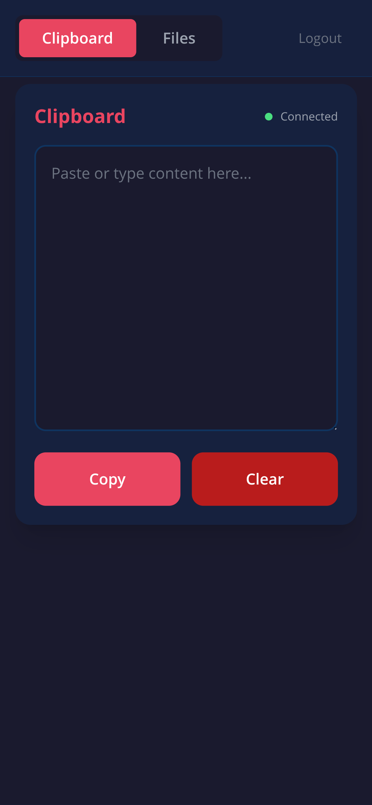
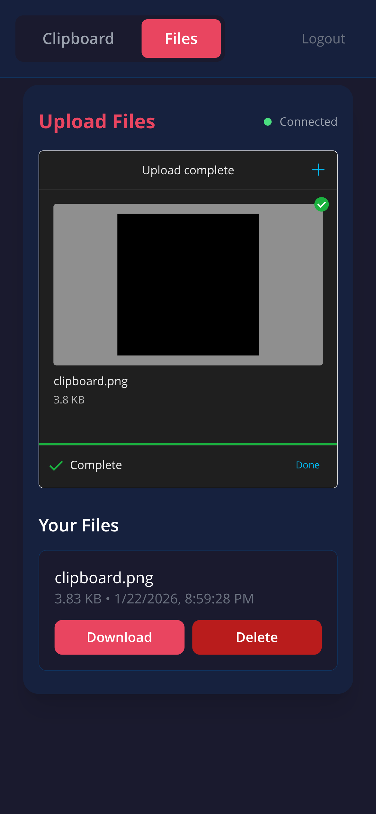

# Clipboard

Shared clipboard service with WebSocket sync for real-time clipboard sharing across devices.

## Features

- 📋 Real-time clipboard synchronization via WebSocket
- 📁 File upload and sharing with resumable uploads (tusd)
- 🔐 Password-based authentication
- 💾 Persistent auth token storage with MongoDB (optional) or in-memory
- 🚀 Easy deployment with Helm
- 💩 Vibe coded AI slop

## Screenshots

<div align="center">
  
  
</div>

## Deployment

#### Add the Helm Repository

```bash
helm repo add clipboard https://raw.githubusercontent.com/ConnorsApps/clipboard/main/helm/
helm repo update
```

#### Install the Chart

```bash
# Create a values file with your configuration
cat > my-values.yaml <<EOF
# yaml-language-server: $schema=https://raw.githubusercontent.com/vidispine/hull/refs/heads/main/hull/values.schema.json

hull:
  objects:
    persistentvolumeclaim:
      files:
        storageClassName: "your-storage-class"
        resources:
          requests:
            storage: 10Gi
    secret:
      clipboard:
        data:
          CLIPBOARD_PASSWORD:
            inline: "your-secure-password"
          MONGODB_URI:
            inline: "mongodb://your-mongo-uri"  # Optional, leave empty for in-memory
EOF

# Install the chart
helm install my-clipboard clipboard/clipboard -f my-values.yaml
```

#### Configuration

The chart uses [HULL](https://github.com/vidispine/hull) for simplified Kubernetes object configuration. All configuration is done via the `values.yaml` file.

Key configuration options:

- `CLIPBOARD_PASSWORD`: Password for authentication (required), The default is `1234`
- `MONGODB_URI`: MongoDB connection string (optional, uses in-memory token store if not set - auth tokens will be lost on restart)
- `FILES_DIR`: Directory for file storage (default: `/data`, mounted from PVC)
